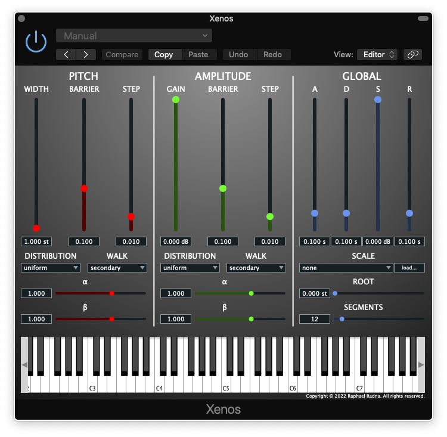

# Xenos

Xenos is a virtual instrument plug-in that implements and extends the Dynamic Stochastic Synthesis (DSS) algorithm invented by Iannis Xenakis. Programmed in C++ with the JUCE framework, Xenos is open-source, cross-platform, and can be built in a number of plug-in formats.



Key features include:
- Authentic DSS engine
- Xenharmonic pitch quantizer
- Custom scale import in the [Scala](https://www.huygens-fokker.org/scala/) format
- Ten stochastic distributions with up to two parameters each
- First- and second-order random walks
- Variable number of segments per wave cycle
- Variable amplitude envelope
- Polyphonic (64 voices by default)
- MIDI implementation (notes, sustain, pitch bend)
- External MIDI controller assignment
- Parameter automation
- Simple and streamlined interface
- Free and open source

Xenos was first presented to the Meta–Xenakis Global Symposium, and is the subject of a master’s degree from the Media Arts and Technology (MAT) program at UC Santa Barbara.

## Quick Start Video

Watch the [Quick Start video](https://youtu.be/ha5xsKm7MtE) on YouTube.

## Installation Notes

Xenos has been tested on macOS 10.14.6 and Windows 10 (64-bit).

### Build from Source

1. Download [JUCE](https://juce.com/get-juce/download)
2. Clone or download [Xenos](https://github.com/raphaelradna/xenos/archive/refs/heads/main.zip)
3. Open Xenos.jucer in the Projucer
4. Export the project for your IDE and platform, e.g., Xcode (macOS) or Visual Studio 2019 (Windows); see [here](https://docs.juce.com/master/tutorial_new_projucer_project.html) for more information
5. Compile Xenos using your IDE (or make on Linux)
6. Move the plug-in binary, e.g., Xenos.component or Xenos.vst3, to the proper location according to your platform, host software, and plug-in format
    - e.g., `/Macintosh HD/Library/Audio/Plug-Ins/Components` (MacOS)
    - e.g., `C:\Program Files\Common Files\VST3` (Windows)
7. Open a suitable plug-in host application and  add Xenos on a software instrument track

### Build from source (Linux)

0. Install dependencies to compile a JUCE project:
    ```
    sudo apt install libasound2-dev libjack-jackd2-dev \
        ladspa-sdk \
        libcurl4-openssl-dev  \
        libfreetype6-dev \
        libx11-dev libxcomposite-dev libxcursor-dev libxcursor-dev libxext-dev libxinerama-dev libxrandr-dev libxrender-dev \
        libwebkit2gtk-4.0-dev
    ```

1. Clone Xenos:
    `git clone https://github.com/raphaelradna/xenos.git`
2. Navigate into Xenos folder:
    `cd xenos`
3. Clone JUCE:
    `git clone https://github.com/juce-framework/JUCE.git`
4. Configure the build:
    `mkdir -p build/Release && cd build/Release && cmake -D CMAKE_BUILD_TYPE=Release -G "Unix Makefiles" ../..`
5. Build Xenos:
    `cmake --build ./ --config Release`

Once built, Xenos VST3 and LV2 plugins will be in `xenos/build/Release/Xenos_artefacts/Release`. 
However, they should have already been automatically copied to the default location for such plugins on you computer (Probably ~/.vst3 and ~/.lv2).

### Pre-Built Binaries

1. Download the latest Xenos release from [GitHub](https://github.com/raphaelradna/xenos/releases)
2. Extract the plug-in binary, i.e., Xenos.component or Xenos.vst3, and move it to the proper location according to your platform, host software, and plug-in format
    - e.g., `/Macintosh HD/Library/Audio/Plug-Ins/Components` (MacOS)
    - e.g., `C:\Program Files\Common Files\VST3` (Windows)
3. Open a suitable plug-in host application and add Xenos on a software instrument track
